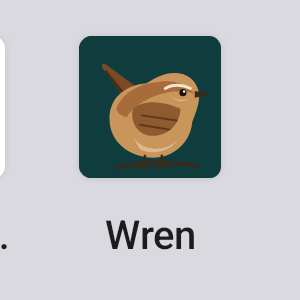

# Wren

[](LICENSE)
[](https://github.com/munzzyy/wren/actions/workflows/test.yml)
[](https://github.com/munzzyy/wren/actions/workflows/reprocheck.yml)

[](https://tern.munzzyy.dev/add/?url=https%3A%2F%2Fgithub.com%2Fmunzzyy%2Fwren)


Wren is a hardened Signal client for Android. It is a fork of
[Molly](https://github.com/mollyim/mollyim-android), which is a fork of
[Signal](https://github.com/signalapp/Signal-Android). It talks to Signal's
servers, so your contacts, groups and calls stay exactly where they are.

Molly adds a passphrase lock for the database, a RAM wiper, automatic locking,
UnifiedPush, Tor and SOCKS support, and a build that needs no Google Play
services. Wren
keeps all of that and adds the things people have asked Signal and Molly for
and never got. If you review privacy software, start with
[docs/THREAT-MODEL.md](docs/THREAT-MODEL.md) and
[docs/AUDIT-GUIDE.md](docs/AUDIT-GUIDE.md); they say what each protection
stops, what it does not, and how to check a build against the source.

A duress passphrase. Type it at the lock screen instead of your real one and
Wren erases every message, key and setting on the phone, right then.

A panic button that erases. Connect a PanicKit trigger such as
[Ripple](https://guardianproject.info/apps/info.guardianproject.ripple/) and
choose whether a press locks Wren or wipes it. Signal and Molly can only lock.

Wipe after wrong unlocks. Five, ten or twenty failed passphrase attempts and
the data is gone.

Export any chat. One chat, as HTML you can open in a browser, plain text, or
JSON, with the photos, voice notes and files next to it. Signal can only dump
every chat at once as JSON, behind a feature flag.

A pure black theme. Dark theme with true black backgrounds for OLED screens,
asked for on Molly's tracker for years. Settings, Appearance, Theme, Black.

A device check. One screen that reads your phone's security patch date, your
screen lock, and the privacy settings that matter most, says which ones are weak,
and fixes the ones Wren controls with one tap. The chat list warns you when
the phone's security updates stopped six months ago.

A panic button that asks first. When a PanicKit trigger app such as Ripple
connects, Wren shows which app it is and asks before it can control anything.
A newly connected trigger can only lock; you choose erase yourself.

Your passphrase again before anything risky. Exporting, turning the lock off,
changing the duress passphrase or the panic action all ask for the passphrase
when the lock is on, and a wrong answer here counts like a wrong unlock.

Erase if nobody unlocks it. Opt in, and if Wren is not unlocked for 3, 7, 14
or 30 days it erases itself. Lock when a USB data connection starts, opt in,
for phones that get plugged into a computer they do not trust.

Encrypted export. Any export can be one `.wrenx` file locked with a
passphrase instead of a plain folder. The format is scrypt plus AES-256-GCM,
documented in [docs/EXPORT.md](docs/EXPORT.md), and
`tools/wren-export-decrypt.py` opens it on a computer.

Route through Orbot from the device check, when Orbot is installed, using
Molly's own proxy code that refuses to connect any other way.

## Why Wren instead of Signal or Molly

Signal is the best mainstream messenger and Wren keeps all of it: the same
protocol, servers, groups, calls and contacts. What Signal will not do is
protect you from the person holding your unlocked phone, and that is the
threat most people who need a hardened client actually face. Molly fixed the
first half of that in 2019 with a passphrase that encrypts the database at
rest, and Wren starts from Molly for that reason.

What Molly still does not do, and Wren does:

- Erase under pressure. A duress passphrase, a limit on wrong unlocks, a panic
  button that can erase, and an opt-in timer that erases if nobody unlocks the
  phone for days. Molly's own tracker has asked for the first of these since
  issue #487 and it is still open there.
- Get your messages out. Export one chat or all of them as HTML, text, JSON
  or one encrypted file. Signal and Molly can only dump everything as JSON
  behind a remote flag, and their per-chat export is for internal builds.
- Show you where you stand. One screen reads the phone's security patch
  date, screen lock and the privacy settings listed in
  [docs/DEVICE-CHECK.md](docs/DEVICE-CHECK.md), warns when something is weak,
  and fixes what Wren controls with one tap.
- Ask before anything risky. The passphrase is required again before an
  export, before the lock is turned off, and before a panic trigger app gets
  control, and the trigger app has to be confirmed by name and signing key.
- Ship without Google. Molly's unified build has carried Firebase in every
  APK since December 2025 (Molly commit b698bbd5, and its
  firebase_messaging.xml); Wren links it only on request and
  `tools/apk-report.sh` proves any APK clean. [docs/FOSS.md](docs/FOSS.md)
  has the details.
- Say what it does not do. The threat model, the audit guide and the panic
  guide name the residual risks, the files to read and the tests to run.

And Wren has a desktop app, which Molly does not:
[munzzyy/wren-desktop](https://github.com/munzzyy/wren-desktop) gives Signal
Desktop an app lock, duress, a proxy and Tor setting that keeps the app
offline when the proxy is down, and one-chat export.

One honest limit: Wren is behind Signal's current release. The status line
under "Status" says by how much, and "Keeping up with Signal" says why.

## Status

Wren is new. The first release, 8.20.5-1, is on the
[Releases](https://github.com/munzzyy/wren/releases) page with its SHA-256
sums, and the reproducible-build check rebuilt it from source in CI and found
every APK identical
([run 37850542233](https://github.com/munzzyy/wren/actions/runs/37850542233)).
The code builds, 2842 unit tests pass in CI, and every feature above is in,
but none of it has been through a round of real-phone testing by people other
than me. Treat it as a beta and keep a backup.

<!-- signal-status -->
Wren is on Signal 8.20.5. Signal's stable release is 8.29.3 (tagged 2026-09-30). Molly's main branch is on Signal 8.19.2. The [daily sync workflow](https://github.com/munzzyy/wren/actions/workflows/sync-upstream.yml) rewrites this line whenever one of those changes.
<!-- /signal-status -->

Releases are signed with this certificate. Check an APK with
`apksigner verify --print-certs`:

```
SHA-256: b66420073b986655a97cb35b166fa5a06abd5119545b9e0b21b087d0f71a7d66
```

## How Wren compares

| | Signal | Molly | Wren |
|---|---|---|---|
| Passphrase encryption of the database | no | yes | yes |
| RAM wiper | no | yes | yes |
| Automatic lock | device screen lock | passphrase lock | passphrase lock |
| UnifiedPush (no Google push) | no | yes | yes |
| Tor and SOCKS proxy | no | yes | yes |
| Runs without Google Play services | yes, websocket fallback | yes | yes |
| Reproducible builds | yes | yes | yes, checked in CI against each release |
| Duress passphrase that wipes | no | no | yes |
| Wipe after N failed unlocks | no | no | yes |
| PanicKit responder | lock only | lock only | lock or wipe |
| Export one chat to HTML, text or JSON | internal builds only | internal builds only | yes |
| Export all chats at once | JSON only, behind a remote flag | JSON only, behind a remote flag | HTML, text, JSON or encrypted |
| Pure black OLED theme | no | no | yes |
| Device check with one-tap hardened defaults | no | no | yes |
| Warning when the phone's security updates are stale | no | no | yes |
| Confirmation before a panic trigger app connects | no | no | yes |
| Passphrase again before exports and lock changes | no | no | yes |
| Erase after N days without an unlock, lock on USB data | no | no | yes |
| Encrypted export (.wrenx) | no | no | yes |
| Google-free by default, with a check script | no | no (since Molly unified its flavors) | yes |

Everything else Signal does, Wren does, because it is Signal underneath.

## Wren on other devices

Wren is a family. Everything talks to Signal's servers, so any Wren, Molly or
Signal app can message any other, and a desktop or tablet links to your phone
the same way Signal Desktop does.

Android, this repository. The phone app, built from Molly.
Desktop, [munzzyy/wren-desktop](https://github.com/munzzyy/wren-desktop),
  built from Signal Desktop for Linux, Windows and macOS. Signal Desktop has no
  app lock at all; Wren Desktop gets a passphrase lock with a duress passphrase,
  wipe after failed attempts, auto-lock, and one-chat export.
iOS, [munzzyy/wren-ios](https://github.com/munzzyy/wren-ios), built from
  Signal iOS. Honest status: without an Apple developer account there is no
  App Store, no TestFlight and no push notifications, because Apple ties
  pushes to Signal's own bundle id. The CI job builds an unsigned IPA (first
  green run on 2026-10-08), but nobody has run it on a phone yet. It can be
  sideloaded for seven days at a time with a free Apple ID, and such a build
  only receives messages while open. That repository explains the limits and
  what changes the day an account exists.

## Install

- Download the APK from [Releases](https://github.com/munzzyy/wren/releases)
  and check the SHA-256 sum. Each release carries one file per CPU type
  (`arm64-v8a` for almost every phone made since 2017, `armeabi-v7a` for old
  32-bit phones, `x86_64` for emulators and some tablets) and a universal file
  that holds all three. Sizes are in [BUILDING.md](BUILDING.md).
- Or install it with [Tern](https://tern.munzzyy.dev), which follows the
  Releases page, checks the signer of every file before it installs, and
  updates Wren when a new tag lands. The badge at the top of this page hands
  the repository to Tern.
- Or add the repository to [Obtainium](https://github.com/ImranR98/Obtainium)
  and let it track releases. Set its APK filter to `^Wren-v.*-arm64-v8a\.apk$`
  so it picks the one file for your phone.
- Or add Wren's own F-Droid repository. In the F-Droid client, open this
  link or scan the QR code on the [repo page](https://munzzyy.dev/wren/fdroid/repo/):

  ```
  https://munzzyy.dev/wren/fdroid/repo?fingerprint=279DA658DD3DD265B4EA91D6B1C0925C9F19D9472A3D315068B2BADB8937DD6F
  ```

  The repo serves the same signed APKs as the Releases page and nothing else.
  [docs/FDROID-REPO.md](docs/FDROID-REPO.md) explains how it is built.

Wren uses the package id `io.github.munzzyy.wren`, so it installs next to
Signal and Molly without touching them. Android 8.1 or newer.



## Moving from Signal or Molly

Wren reads the same local backups Signal and Molly write. Make a backup in
the old app, install Wren, restore from that file, and the old app can be
removed. Backups must come from the same or an older Signal version than
the one Wren is built on.

If you want to try Wren before moving your number, link it to your existing
Signal account as a secondary device (Settings, Linked devices). That is also
the safe way to test the duress wipe: it only erases the linked device.

Molly's own guide, [Migrating From
Signal](https://github.com/mollyim/mollyim-android/wiki/Migrating-From-Signal),
applies to Wren as written.

## The duress passphrase, honestly

Settings, Privacy, Data at rest. The duress passphrase only exists when the
regular passphrase lock is on. It costs the same to try as the real
passphrase, so it cannot be brute-forced from a copy of the app's files.

What a wipe does: deletes Wren's database, keys, preferences, caches and
attachments, then the app exits. There is no undo and no confirmation.

What a wipe does not do:

- It does not touch backups or chat exports you saved elsewhere.
- It does not erase your messages from other people's phones or from your
  linked devices.
- It does not unregister your number. Turn on Signal's Registration Lock PIN
  so nobody can re-register it.
- It does not promise anything about flash storage forensics. Android's
  file-based encryption helps, Wren's passphrase helps, a wipe is not a
  guarantee.
- It does nothing if the phone was copied before the wipe.

[docs/DURESS.md](docs/DURESS.md) has the full threat model.
[docs/DEVICE-CHECK.md](docs/DEVICE-CHECK.md) covers the device check and the black theme.
[docs/THREAT-MODEL.md](docs/THREAT-MODEL.md) is the whole-app threat model,
[docs/AUDIT-GUIDE.md](docs/AUDIT-GUIDE.md) maps every protection to its code,
and [docs/PANIC.md](docs/PANIC.md) covers connecting a trigger app.

## Chat export

Open a chat, tap the name, Export chat. Or Settings, Chats, Export all chats,
which writes one folder per chat and shows how many were written when it is
done. Every export notification has a Cancel button. Pick HTML, text or JSON, choose
whether to include media, pick a folder. Wren writes `chat.html` (or `.txt`,
`.json`) and a `media/` folder next to it and shows a notification when it is
done. The export is not encrypted. Disappearing messages are exported as they
are at that moment. Details in [docs/EXPORT.md](docs/EXPORT.md).


## Known gaps

- Two small native libraries Wren inherits from Molly, the Argon2 passphrase
  hasher and Molly's native utils, are built with 4 KB page alignment. Phones
  that boot with 16 KB pages (some Android 15 and 16 devices) run them in a
  compatibility mode. Every other native library in the app, including
  libsignal, is 16 KB aligned. Rebuilding those two with a current NDK is on
  the list; `tools/apk-report.sh` flags them until then.
- The black theme, the device check and both wipes have unit tests and a
  clean build behind them but have not been looked at on a real phone yet.
- Wren is behind Signal's current release; the status line under "Status" has
  the numbers and "Keeping up with Signal" has the reason.

## Keeping up with Signal

Signal clients stop working about 90 days after they were built, and Signal
can also expire a client by its Signal version from the server. A fork that
falls behind dies, so the native library rebuild in
[docs/NATIVE.md](docs/NATIVE.md) has a deadline, not just a wish. Wren started from Molly, which was on Signal 8.19.2; I
merged Signal 8.20.5 on top myself (every conflict and decision is in
[docs/SIGNAL-MERGE-LOG.md](docs/SIGNAL-MERGE-LOG.md)), so Wren is one step
ahead of Molly, and the status line under "Status" says how far Signal has
moved since.

The rest of the gap has one cause, and it is the same one that holds Molly
back: Signal 8.21 and later need newer builds of two native libraries,
libsignal and RingRTC. Molly ships its own hardened forks of both (they keep
calls and all traffic inside your proxy, with no direct fallback), and the
newest forks Molly has published are the ones 8.20 needs. Getting past 8.20
means either rebuilding those forks for the newer versions, or using Signal's
own builds and giving up the call proxy. I am not making that trade quietly;
it is written here so you can see it.

[docs/NATIVE.md](docs/NATIVE.md) is the recipe for rebuilding those two
libraries from Molly's patches.

A daily workflow fetches both upstreams, rewrites the status line under
"Status", and opens an issue within a day of Molly moving, with the exact
commit range and the version gap, so the lag is always public. `tools/merge-molly.sh` does a Molly merge and reruns the rebrand.

## Build it yourself

See [BUILDING.md](BUILDING.md). The short version: JDK 21, the Android SDK,
and

```sh
./gradlew :app:assembleProdStoreRelease
```

`prodStore` has no in-app updater and is what ships on GitHub. `prodWebsite`
checks the Wren F-Droid repository for updates. The build is reproducible;
[reproducible-builds/README.md](reproducible-builds/README.md) explains how to
check a release against the source.

Molly's build takes the app name and package id from `app/gradle.properties`,
which is what makes Wren possible without touching thousands of files. After
every merge, `tools/rebrand.py` rewrites the app name in every string
resource file and leaves MollySocket alone.

## Questions people ask

Is a third-party client allowed on Signal's servers? Signal does not
support them and could block them. It has tolerated Molly since 2020. Wren
behaves the same way Molly does on the network and uses no Signal branding.
Read the [Signal Terms](https://signal.org/legal/) before you register.

Why not just add this to Molly? Molly's tracker has asked for a duress
password ([issue #487](https://github.com/mollyim/mollyim-android/issues/487),
with a pull request still open). I wanted it on my own phone this year, and a
fork is how you get there. Fixes that belong upstream go upstream.

Can I run Wren next to Signal or Molly? Yes, with a different number, or
as a linked device of the same account.

Which version should I install? There is one build, and it contains no
Firebase or Play Services code at all; `tools/apk-report.sh` proves it on any
APK, and [docs/FOSS.md](docs/FOSS.md) explains what changed from Molly. A
build with Google's push service exists for people who want it
(`-PwrenFcm=true`). Push notifications come over a WebSocket or UnifiedPush.

Where is the desktop app? In [munzzyy/wren-desktop](https://github.com/munzzyy/wren-desktop),
see "Wren on other devices". Plain Signal Desktop links to a Wren account too.

## For reviewers

If you review privacy software for a living, start with
[docs/THREAT-MODEL.md](docs/THREAT-MODEL.md) and
[docs/AUDIT-GUIDE.md](docs/AUDIT-GUIDE.md). They say what each protection
stops, what it does not, which files to read, and what to test first.
[SECURITY.md](SECURITY.md) has the disclosure policy.

## Contributing

Issues and pull requests are welcome. Keep changes small, match the
surrounding style, and say what you tested. Security problems go to the
address in [SECURITY.md](SECURITY.md), not the tracker.

## License

AGPL-3.0-only, the same license as Signal and Molly. [LEGAL.md](LEGAL.md)
covers copyright and trademarks. Wren is not affiliated with Signal
Messenger, LLC, the Signal Foundation or the Molly project.

## Thanks

Signal for the protocol, the app and the servers. Molly for years of
hardening work that Wren stands on.
